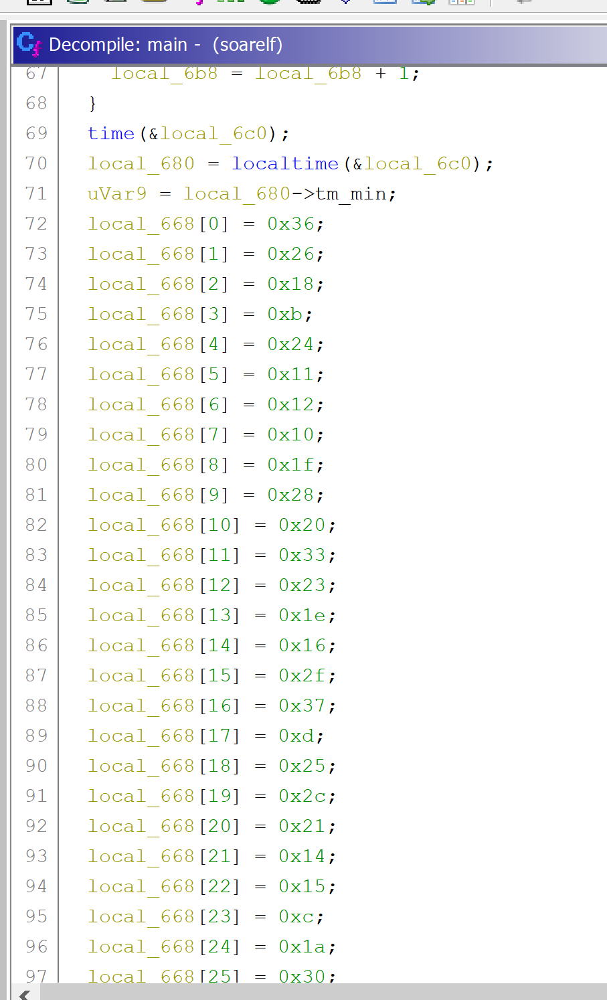
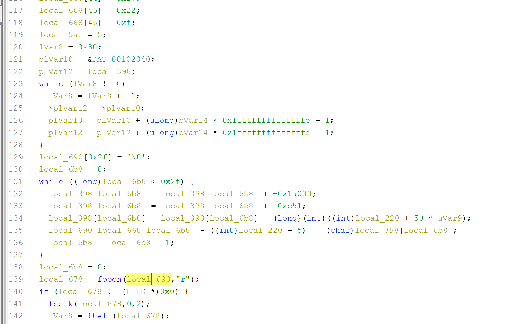
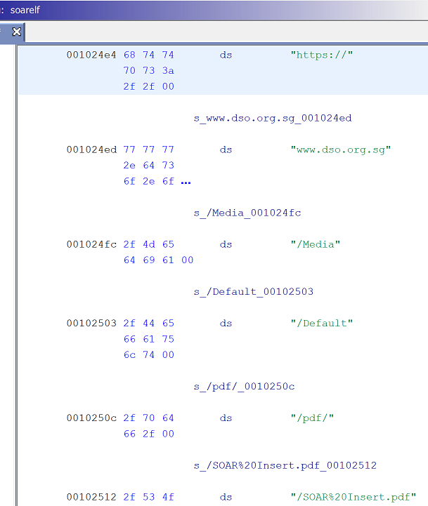
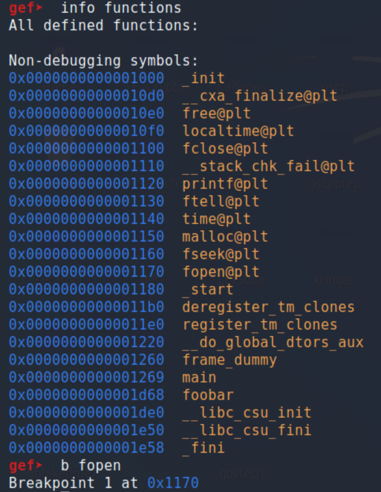
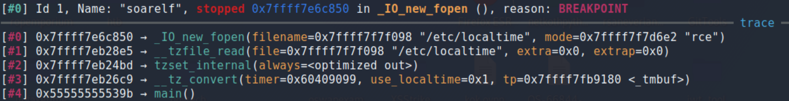
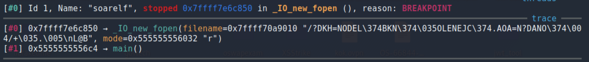
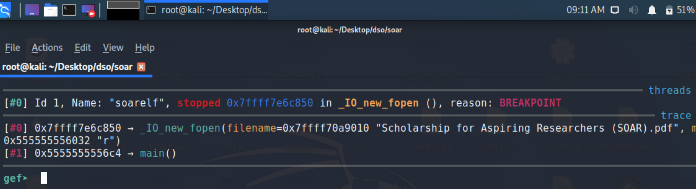

# SOAR [300 pts] (Assigned Writeup)
>Looking for a scholarship?
Help us find the secret hidden in this one!

>Files (Any of the links are fine):
https://nusdsoctf2.s3-ap-southeast-1.amazonaws.com/S3/SOAR/SOAR-challenge.pdf

## TL;DR
* binwalk reveals a password-protected .zip file inside provided PDF
* Crack zip password via alphanumeric bruteforce / wordlist from PDF / guessing.
* Zip file contains a binary, reversing reveals interesting calls retrieving current system minute and hour
* Dynamic analysis reveals it tries to read a “SOAR” file and actual SOAR brochure url
* Download SOAR pdf into same directory, bruteforce system time, binary outputs flag when time is 7:11pm

## Writeup
_Note: this challenge has the least elegant / most stupid solution out of all the challenges I solved... and then I got assigned this challenge for one of my mandatory writeups LOL. pls don’t judge, I am bad but slightly less bad than this writeup may bring across_

We are given a SOAR-Challenge.pdf that is open-able and displays this DSO Mid-Term Scholarship advertisement:


#### Stage 1 - File Forensics
Opening the pdf in [peepdf](https://github.com/jesparza/peepdf) reveals a bunch of objects and streams!

``` console
root@kali:~/Desktop/dso/soar# peepdf SOAR-challenge.pdf
File: SOAR-challenge.pdf
MD5: 4104a9572d9161eb990a3ae10a43198f
SHA1: 51035622adecb8ddc7600f9866b3dce1e6e39c09
SHA256: ec04d8574074854d4f839ec80e71df6b32765851222eecd82446a018f71cc95a
Size: 41611 bytes
Version: 1.4
Binary: True
Linearized: False
Encrypted: False
Updates: 0
Objects: 34
Streams: 15
URIs: 0
Comments: 0
Errors: 0

Version 0:
        Catalog: 5
        Info: 3
        Objects (34): [1, 2, 3, 4, 5, 6, 7, 8, 9, 10, 11, 12, 13, 14, 15, 16, 17, 18, 19, 20, 21, 22, 23, 24, 25, 26, 27, 28, 29, 30, 31, 32, 33, 34]
        Streams (15): [1, 6, 7, 8, 9, 10, 11, 12, 13, 19, 22, 25, 28, 32, 34]
                Encoded (15): [1, 6, 7, 8, 9, 10, 11, 12, 13, 19, 22, 25, 28, 32, 34]
                Decoding errors (15): [1, 6, 7, 8, 9, 10, 11, 12, 13, 19, 22, 25, 28, 32, 34]
```

Many of the objects contain nothing more than a stream of length 1000+. When I try to print the corresponding streams, there is no printable output. Weird.

``` console
PPDF> object 9

<< /Length 1952
/Filter /FlateDecode >>
stream

endstream

PPDF> object 10

<< /Length 2065
/Filter /FlateDecode >>
stream

endstream

PPDF> object 11

<< /Length 1584
/Filter /FlateDecode >>
stream

endstream
```

It seems like the PDF could be hiding some data! We can run binwalk to extract hidden files, if any.

``` console
root@kali:~/Desktop/dso/soar# binwalk -e SOAR-challenge.pdf

DECIMAL       HEXADECIMAL     DESCRIPTION
--------------------------------------------------------------------------------
0             0x0             PDF document, version: "1.4"
70            0x46            Zip archive data, at least v2.0 to extract, compressed size: 4729, uncompressed size: 4760, name: soar.zip
40792         0x9F58          End of Zip archive, footer length: 22
```

Looks like there is indeed a Zip archive “hidden” within the PDF! If we try to unzip it, it requests for a password.

``` console
root@kali:~/Desktop/dso/soar/_SOAR-challenge.pdf.extracted# 7z e soar.zip

7-Zip [64] 16.02 : Copyright (c) 1999-2016 Igor Pavlov : 2016-05-21
p7zip Version 16.02 (locale=en_US.utf8,Utf16=on,HugeFiles=on,64 bits,2 CPUs Intel(R) Core(TM) i5-8250U CPU @ 1.60GHz (806EA),ASM,AES-NI)

Scanning the drive for archives:
1 file, 4760 bytes (5 KiB)

Extracting archive: soar.zip
--
Path = soar.zip
Type = zip
Physical Size = 4760


Enter password (will not be echoed):
ERROR: Wrong password : soar

Sub items Errors: 1

Archives with Errors: 1

Sub items Errors: 1

```

We first tried using a dictionary attack, attempting all the passwords in the famous rockyou.txt to unzip the file. However, nothing works. I eventually use [crunch](https://github.com/crunchsec/crunch) to generate a password list of all alphanumeric permutations with lengths 1-6, and try that password list on the zip file.

``` python
import os,sys

f = open('wordlist.lst','r')
lines = f.read().splitlines()

for line in lines:
	x = os.system(f'7z e soar.zip -p{line}')
	if x == 0:
		print '[~] Password is : {0}\n\n'.format(line)
		exit(1)
```

The password turned out to be `dso` :D

With the password cracked, we can now extract the contents of the zip file. It contains a singular file - which turns out to be a x86-64 binary!

``` console
root@kali:~/Desktop/dso/soar# file soarelf
soarelf: ELF 64-bit LSB pie executable, x86-64, version 1 (SYSV), dynamically linked, interpreter /lib64/ld-linux-x86-64.so.2, BuildID[sha1]=5b771addb748ee385507e1d07dc511cfdf55ad15, for GNU/Linux 3.2.0, not stripped
```
We notice that it’s not stripped, meaning that any functions will (hopefully) be easier to find, and may contain some debug info. Running the binary, it appears nothing happens. We can try to pipe the output into a file for more details - but it appears that the only output is a singular newline char byte.

``` console
root@kali:~/Desktop/dso/soar# ./soarelf > soarout
root@kali:~/Desktop/dso/soar# ls -lah
...
-rw-r--r-- 1 root root    1 Feb 27 09:02  soarout
...
```

**Ghidra’s decompiler** output makes it apparent that there is a 47-char string. However, converting those hex values into text gives us gibberish.

{height = 50%}

Looking through the decompilation output, we can see that a few operations and XORs are performed on/using this original string ``(local_668)``, which eventually manipulates `local_690` (lines 130 to 136). We can presume `local_690` is a character array with 47 printable characters, seeing that a null byte is set at location `0x2f` (or index 47, aka 48th char) (line 129). `local_690` apparently becomes a filename that `fopen` attempts to read (line 139). A file must successfully be read, since the rest of the code only executes if the return value of the `fopen` call is non-null (line 140).



Now, we need to figure out the file name! Looking at some of the operations leads us to some data in the binary that are likely strings that are XOR-ed/other stuff. I really didn’t want to reverse this because I was tired. However, in the same data section I do come across the following:



Looks like a web link! Viewing the link on a browser reveals a copy of the pamphlet/ad we received as part of the challenge. Looks like this is the original PDF file that this challenge was built on! I assume that it’s just some “winner” message that pops up once you solve the challenge advertising their scholarship, aka not helpful right now.

Anyways, since I didn’t want to reverse SOAR, we can do some dynamic analysis to get closer to figuring out what’s going on. We open the binary in **gdb**, and set a breakpoint at the `fopen` function.



We can see that the program execution first hits a breakpoint when it tries to open ``/etc/localtime``. This is a symbolic link to a file that provides us with the current timezone/time. Interesting...



We continue execution and see a second `fopen` call. This time, the filename is gibberish - but 47 characters long! This appears to be the line where we attempt to open the file with a name matching the value of `local_690`.



I repeated this a few times, and noticed that occasionally, the gibberish is the same as my previous round of execution. However, I sometimes get new gibberish as well!

>_FULL DISCLOSURE - I just so happened to be attempting this at ~5.08 PM. I actually hit the correct minute (11) on accident while testing and saw the fopen try to open the correct filename, but couldn’t reproduce it soon after. This probably helped me realise that it was a time-dependent thing, though I’d like to think that I would’ve solved this eventually regardless_

What could be going on? Why is there a call to ``/etc/localtime``? Looking back at the decompilation output, I see the following code near the start of the main function:

``` C
69 time(&local_6c0);
70 local_680 = localtime(&local_6c0);
71 uVar9 = local_680->tm_min;
```
Sure enough, ``uVar9`` (which is assigned to the ``tm_min`` of the struct returned by ``localtime()``, aka the current minute) is used in the operations that generate the string used in the ``fopen`` call (*end of line 134*),


``` C
131 while ((long)local_6b8 < 0x2f) {
132   local_398[local_6b8] = local_398[local_6b8] + -0x1a000;
133   local_398[local_6b8] = local_398[local_6b8] + -0xc51;
134   local_398[local_6b8] = local_398[local_6b8] - (long)(int)((int)local_220 + 5U ^ uVar9);
135   local_690[local_668[local_6b8] - ((int)local_220 + 5)] = (char)local_398[local_6b8];
136   local_6b8 = local_6b8 + 1;
137 }
138 local_6b8 = 0;
139 local_678 = fopen(local_690,"r");
140 if (local_678 != (FILE *)0x0) {
```

Therefore, I need to bruteforce my time’s minute! I tried to overwrite ``/etc/localtime``, but I probably messed up somewhere because that didn’t change the program’s behaviour, and ``time()`` still always took the VM’s current time. Therefore, one can use the ``timedatectl`` command to set the current time:

``timedatectl set-time '2021-02-27 00:XX:00'``

(You can script this, though I did it manually, because I hit the correct time accidentally and knew it was around 5.10pm).

When our time has minute == 11, the string passed into the second ``fopen`` call looks like this:



Aha! We need to have a file in the same directory with that name!

At this point, I realise that the link to the original SOAR scholarship PDF might not be there for no reason - perhaps the binary wants to open that specific file? We download the file and rename it as required.

``` console
root@kali:~/Desktop/dso/soar# curl https://www.dso.org.sg/Media/Default/pdf//SOAR%20Insert.pdf > 'Scholarship for Aspiring Researchers (SOAR).pdf'
  % Total    % Received % Xferd  Average Speed   Time    Time     Time  Current
                                 Dload  Upload   Total   Spent    Left  Speed
100   99k  100   99k    0     0   237k      0 --:--:-- --:--:-- --:--:--  237k
```

Looking back at the binary, we see the following line of code, indicating that the current hour is used!

```C
146 iVar2 = local_680->tm_hour;
// a bunch of operations using iVar2 below
```
This `iVar2` integer is used in a bunch of subsequent code that I didn’t want to reverse. Hence, I bruteforced the current hour with a Python script:

```python
import os
for i in range(24):
 os.system(f"timedatectl set-time '2021-02-27 {i:02d}:11:00'")
 os.system(f"./soarelf > {i}out")
```
When the hour is 11 and time is 11, we get an output with a file size > 1. In fact, it’s 65 bytes large, which is coincidentally would be the size of a SHA-256 hash + 1 newline character :O

``` console
root@kali:~/Desktop/dso/soar# ls -lah
...
-rw-r--r-- 1 root root    1 Feb 27 01:11  1out
-rw-r--r-- 1 root root   65 Feb 27 11:11  11out
-rw-r--r-- 1 root root    1 Feb 27 12:11  12out
...
```

It contains the flag! :)

## Takeaways
* Found this challenge very weird, maybe because you were supposed to reverse it and retrieve specific values but I just whacked things based on intuition and it worked
* When static analysis is a pain, it can be complemented with dynamic analysis (and you don’t have to always go one or the other)
* Should use tools like CEWL to generate contextual wordlists for future password-cracking challenges
* Learned how to brute force system time on my VM
* My conscience is happy that we would’ve won the $400 without these 300 points because I’m not sure I deserved to solve this lol
